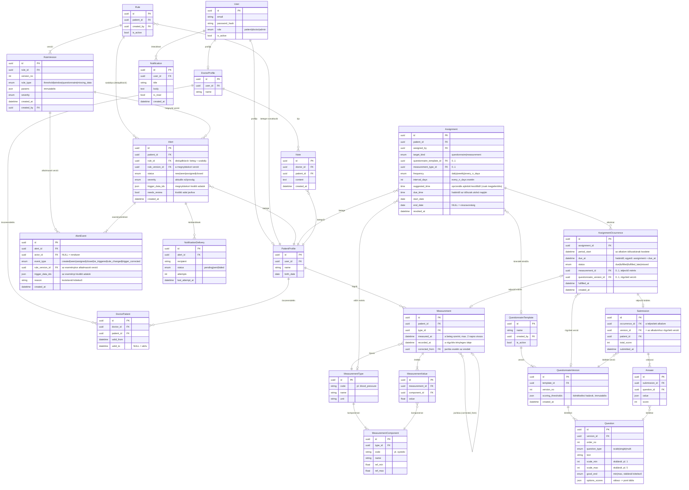

# Adatmodell (E-K diagram)

> A diagram Mermaid-formátumú (GitHub megjeleníti); a leadandó változat
> draw.io-ban készül ugyanebből a tartalomból.

## Tervezési indoklás

**Immutabilis verziók.** A `Rule` és a `QuestionnaireTemplate` csak identitást
hordoz; a tényleges paraméterek a `RuleVersion`, illetve a
`QuestionnaireVersion` + `Question` rekordokban élnek, amelyek létrejöttük
után nem módosulnak — minden változtatás új verziósort szúr be. A riasztás
eseményei a náluk alkalmazott szabályverzióra, a kitöltések az alkalomhoz
rögzített kérdőívverzióra hivatkoznak, így a régi riasztások és kitöltések
jelentése és pontszáma utólag nem változhat.

**Előírás és alkalom.** Az `Assignment` az orvos által beállított, ismétlődő
előírás (mit, milyen gyakran, milyen határidővel és ajánlott kezdőidővel,
mettől meddig). Egyes alkalmai külön `AssignmentOccurrence` sorok, amelyeket
egy ütemezett háttérfolyamat menet közben hoz létre — nem előre, egész
időszakra —, így az előírás módosítása vagy visszavonása nem igényli előre
legyártott sorok törlését. Minden alkalom rögzíti a saját határidejét,
státuszát (esedékes, teljesítve, késve teljesítve, elmulasztva) és a
teljesítő mérést vagy kitöltést; az `(assignment_id, due_at)` egyedi
megkötés garantálja, hogy a háttérfolyamat ismételt futása sem hoz létre
dupla alkalmat. Minden alkalomhoz egy időszak tartozik (`period_start` –
következő alkalom kezdete; napi előírásnál a naptári nap, heti vagy N napos
előírásnál a teljes időköz), a határidő (`due_at`) az időszak utolsó napján
van. A mérés a mérés időpontja (`measured_at`) alapján ahhoz az alkalomhoz
rendelődik, amelynek időszakába esik. Ha a rögzítés (`recorded_at`) a
határidő előtt történik, az alkalom teljesítve, ha utána, késve teljesítve;
mérést legfeljebb két napra visszamenőleg lehet rögzíteni, így az elmulasztott
alkalom az időszaka vége után két napig pótolható. Kérdőívnél nincs
visszadátumozás: a kitöltés a legrégebbi, még pótolható alkalomhoz rendelődik.
A `suggested_time` csak a beteg felületén megjelenő ajánlás, a hozzárendelést
nem befolyásolja.

**Riasztás és szabályverziók.** A deduplikáció a `rule_id` alapján történik
(beteg + szabály), ezért egy szabály módosítása után ugyanaz a nyitott
riasztás folytatódik, új riasztás nem keletkezik. Az `Alert` a megnyitáskori
verziót és kiváltó adatokat őrzi, minden további esemény (`AlertEvent`) a
saját alkalmazott verzióját és kiváltó adatait tárolja; így az
eseménytörténetből minden lépésnél kiolvasható, melyik verzió, milyen adat
alapján mit állapított meg.

**Javított mérés.** A javítás nem írja felül az eredetit: az új `Measurement`
a `corrected_from` mezővel hivatkozik rá. A javítás újrakiértékelést vált ki,
amely `trigger_corrected` eseményként rögzül; ha a feltétel már nem teljesül,
a riasztás nem záródik le automatikusan, hanem `needs_review` jelölést kap,
és az orvos zárja le indoklással.

**Beteg-státusz.** A státusz (Súlyos, Figyelem, Adathiány, Kezelve, Rendben)
számított érték, nem tárolt mező: a nyitott riasztásokból, az alkalmak
teljesítéséből, a friss adat meglétéből és a lezárás utáni megerősítő adatból
áll elő. Adat nélkül (pl. frissen felvett beteg) a státusz Adathiány, nem
Rendben. Előírás nélkül a frissességi határ (alapértelmezés szerint 7 nap)
rendszerszintű beállítás, ezért nem igényel külön mezőt. A számítás szabályait
a működési szabályokat bemutató fejezet írja le példákon.

**Pontozás iránya.** A pontozás egységes: több pont = rosszabb állapot. A
skálás kérdésnél a kérdőív készítője kötelezően megadja, melyik vég jelenti a
jobb állapotot (`good_end`); a rendszer ebből képlettel számítja ki a
válasz → pont táblát (a jobb vég mindig 0 pont), és ezt a verzióban
(`options_scores`) tárolja. Kitöltéskor a pontszám a tárolt táblából
olvasódik ki, így egy későbbi kódmódosítás sem változtathatja meg a régi
kitöltések pontjait.

**Többértékű mérés.** A vérnyomás két értékből áll (szisztolés/diasztolés),
ezért a méréstípus komponensekre bomlik (`MeasurementComponent`), és egy
mérés komponensenként egy-egy `MeasurementValue` sort kap. Ez normalizált
megoldás: a szabálykiértékelés komponens-szinten tud küszöböt vizsgálni, és
új többértékű típus séma­módosítás nélkül vehető fel. Az alternatíva (értékek
JSONB-oszlopban) a dolgozat relációs vs. NoSQL alfejezetében kerül
összevetésre.

**Riasztás-életút és kézbesítés.** Az `Alert` státuszváltásai kizárólag
`AlertEvent` rögzítésével történnek (ki, mikor, mit, lezárásnál indoklás).
Az e-mail-kézbesítést a `NotificationDelivery` külön követi újrapróbálkozási
számlálóval — a riasztás létrejötte tranzakcionális, a küldés ettől független.

**Összerendelés időbeli érvényességgel.** A `DoctorPatient` `valid_from` /
`valid_to` mezőkkel írja le a kapcsolat élettartamát; a jogosultság-szűrés
mindig az aktív (le nem zárt) összerendeléseken alapul.

**UUID elsődleges kulcsok.** Minden tábla azonosítója UUID, nem sorszámozott
egész. Az elsődleges védelem a szerveroldali jogosultság-szűrés; az UUID
pluszréteg (defense in depth): a 2¹²² méretű véletlen tér miatt idegen
rekordok azonosítói végigpróbálgatással (enumerációval) nem találhatók el, és
az azonosító nem szivárogtat mennyiségi információt (pl. hány beteg van a
rendszerben). Ára a nagyobb tárigény (16 bájt) és a szórtabb index — a vállalt
adatmennyiségnél ez nem érdemi hátrány.

**Egész pontszámok.** A kérdőív-pontszámok (`Answer.score`,
`Submission.total_score`) szándékosan egészek: ez a klinikai kérdőívek
konvenciója (pl. PHQ-9), és kizárja a lebegőpontos összehasonlítás hibáit a
szabályhatár-vizsgálatoknál. A számított értékek (pl. trendvizsgálat
átlaga) futásidőben lehetnek törtek, de tárolt pontszám nem.

**Tudatosan elhagyott mezők.** A diagram a szerkezetet mutatja, nem a teljes
mezőlistát. A betegprofil a bemutatáshoz szükséges szűk adattartalommal
marad: az éles rendszerben elvárt további adatok (nem, TAJ-szám, telefonszám,
lakcím) a demonstrációs scope-ból tudatosan kimaradtak, mert kizárólag
mesterséges adatokkal dolgozunk. Utólagos felvételük egy-egy oszlop
hozzáadása (Alembic-migráció), a szerkezetet nem érinti.

**Későbbre halasztva:** általános `AuditLog` tábla az adminisztratív
műveletek naplózására — a két központi modul elsőbbséget élvez.
