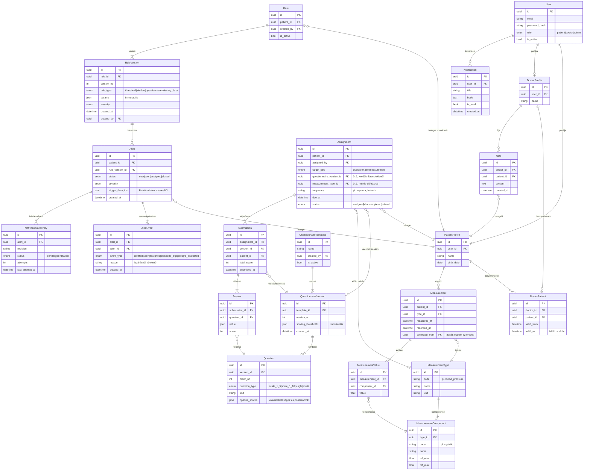

# Adatmodell (E-K diagram)

> A diagram Mermaid-formátumú (GitHub megjeleníti); a leadandó változat
> draw.io-ban készül ugyanebből a tartalomból.

## Tervezési indoklás

**Immutabilis verziók.** A `Rule` és a `QuestionnaireTemplate` csak identitást
hordoz; a tényleges paraméterek a `RuleVersion`, illetve a
`QuestionnaireVersion` + `Question` rekordokban élnek, amelyek létrejöttük
után nem módosulnak — minden változtatás új verziósort szúr be. Az `Alert` a
kiváltó szabályverzióra, a `Submission` a kitöltéskori kérdőívverzióra
hivatkozik, így a régi riasztások és kitöltések jelentése és pontszáma utólag
nem változhat.

**Többértékű mérés.** A vérnyomás két értékből áll (szisztolés/diasztolés),
ezért a méréstípus komponensekre bomlik (`MeasurementComponent`), és egy
mérés komponensenként egy-egy `MeasurementValue` sort kap. Ez normalizált
megoldás: a szabálykiértékelés komponens-szinten tud küszöböt vizsgálni, és
új többértékű típus séma­módosítás nélkül vehető fel. Az alternatíva (értékek
JSONB-oszlopban) a dolgozat relációs vs. NoSQL alfejezetében kerül
összevetésre.

**Javított mérés.** A javítás nem írja felül az eredetit: az új `Measurement`
a `corrected_from` mezővel hivatkozik rá. A javítás újrakiértékelést vált ki,
amely `re_evaluated` eseményként rögzül az érintett riasztás történetében.

**Riasztás-életút és kézbesítés.** Az `Alert` státuszváltásai kizárólag
`AlertEvent` rögzítésével történnek (ki, mikor, mit, lezárásnál indoklás).
Az e-mail-kézbesítést a `NotificationDelivery` külön követi újrapróbálkozási
számlálóval — a riasztás létrejötte tranzakcionális, a küldés ettől független.

**Összerendelés időbeli érvényességgel.** A `DoctorPatient` `valid_from` /
`valid_to` mezőkkel írja le a kapcsolat élettartamát; a jogosultság-szűrés
mindig az aktív (le nem zárt) összerendeléseken alapul.

**UUID elsődleges kulcsok.** Minden tábla azonosítója UUID, nem sorszámozott
egész. Az elsődleges védelem a szerveroldali jogosultság-szűrés; az UUID
pluszréteg (defense in depth): a 2¹²² méretű véletlen tér miatt idegen
rekordok azonosítói végigpróbálgatással (enumerációval) nem találhatók el, és
az azonosító nem szivárogtat mennyiségi információt (pl. hány beteg van a
rendszerben). Ára a nagyobb tárigény (16 bájt) és a szórtabb index — a vállalt
adatmennyiségnél ez nem érdemi hátrány.

**Egész pontszámok.** A kérdőív-pontszámok (`Answer.score`,
`Submission.total_score`) szándékosan egészek: ez a klinikai kérdőívek
konvenciója (pl. PHQ-9), és kizárja a lebegőpontos összehasonlítás hibáit a
szabályhatár-vizsgálatoknál. A szerkesztő kérdésenként csak egész pontot enged
felvenni, így az összeg sem lehet tört; a számított értékek (pl. trendvizsgálat
átlaga) futásidőben lehetnek törtek, de tárolt pontszám nem.

**Tudatosan elhagyott mezők.** A diagram a szerkezetet mutatja, nem a teljes
mezőlistát: a betegprofilban éles rendszerben elvárt további adatok — nem
(orvosilag releváns, pl. referenciatartományoknál), TAJ-szám, telefonszám,
lakcím — a demonstrációs scope-ból tudatosan kimaradtak, mert kizárólag
mesterséges adatokkal dolgozunk, és minden további mező karbantartó felületet
és tesztet is igényelne. Utólagos felvételük egy-egy oszlop hozzáadása
(Alembic-migráció), a szerkezetet nem érinti. *Konzultációs kérdés: elegendő-e
így, vagy kerüljön be 1–2 további mező (pl. nem)?*

**Megfontolás alatt:** `AuditLog` tábla az adminisztratív műveletek
naplózására — az M2 tapasztalatai alapján dől el, bekerül-e a scope-ba.
