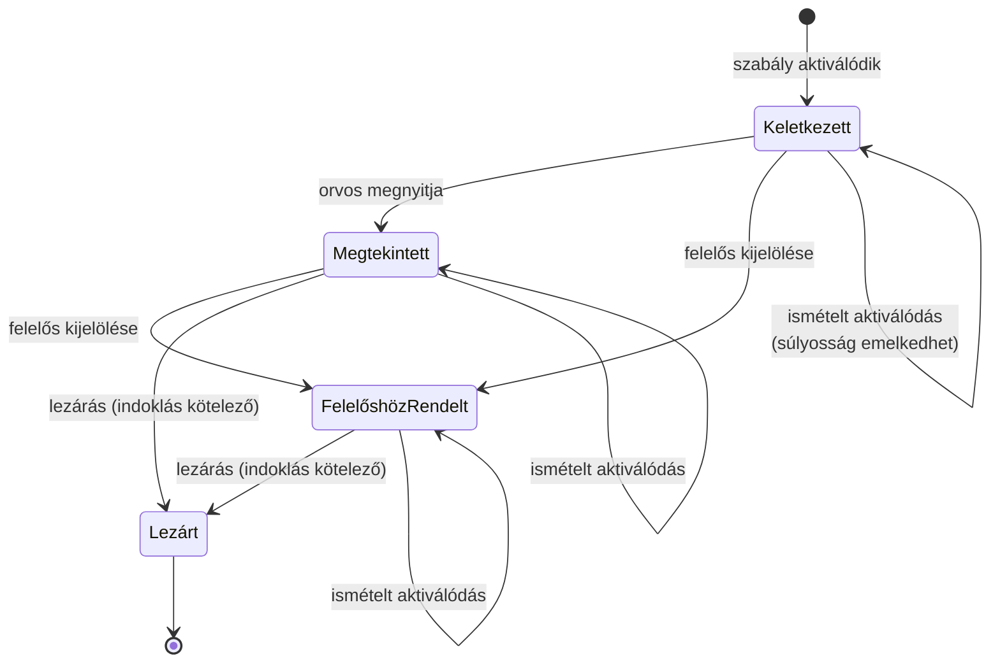
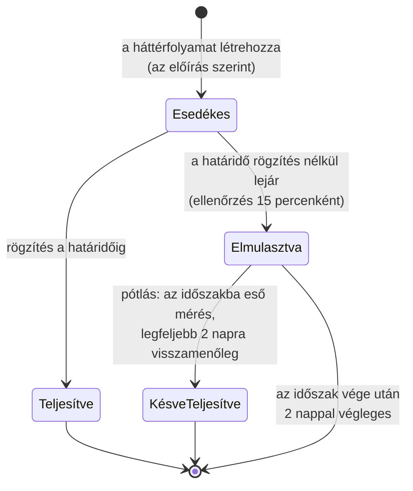
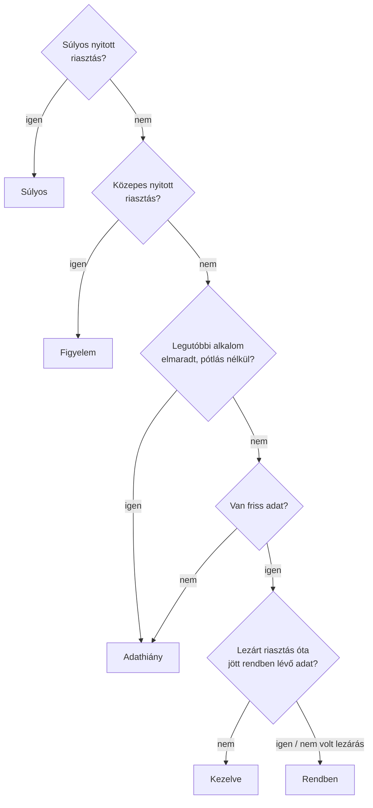
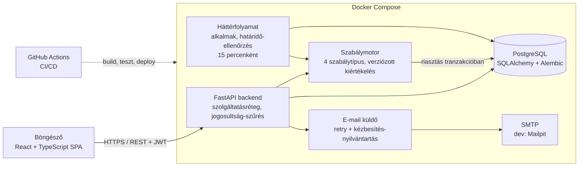

# Folyamat- és architektúraábrák

Kiegészítő ábrák az adatmodellhez: a riasztás és az alkalom életciklusa, a
beteg-státusz előállítása és a rendszer architektúrája. A működési
szabályokat példákon a `07_mukodesi_szabalyok.md` mutatja be.

## Riasztás-életút (állapotgép)

Minden átmenet `AlertEvent`-ként rögzül (ki, mikor, mit, melyik
szabályverzió, milyen kiváltó adat); a lezárás indoklása kötelező. A nyitott
riasztás melletti új kiváltó adat nem új riasztás, hanem „ismételt
aktiválódás” esemény. A szabály módosítása és a kiváltó adat javítása szintén
eseményként rögzül, állapotváltás nélkül; javítás után a riasztás
„kiváltó adat javítva” jelölést kap, és csak az orvos zárhatja le.

## Alkalom-életciklus (egy előírás egy alkalma)

Az alkalmakat az ütemezett háttérfolyamat hozza létre az előírás szerint, és
ugyanez a folyamat jelöli elmulasztottnak a lejárt, teljesítetlen alkalmakat
— akkor is, ha semmilyen adat nem érkezik. Mérés rögzítésekor a rendszer
előbb ugyanezt az ellenőrzést futtatja, így a határidő után rögzített mérés
mindig már elmulasztott alkalomhoz kerül, és azt késve teljesíti.

Az elmulasztás a beteg státuszát Adathiányra állítja; az „elmaradt
adatküldés” szabály a beállított számú elmulasztás után riasztást nyit.

## A beteg-státusz előállítása

Friss adat: ahol már lejárt alkalom van, a frissességet az alkalmak
teljesítése adja (ezt a „Legutóbbi alkalom elmaradt?” pont vizsgálja). Előírás
nélkül, illetve az első határidő előtt a legutóbbi mérés vagy kitöltés
legfeljebb 7 napos (rendszerszintű beállítás). Adat nélküli, frissen felvett
beteg így Adathiány.

## Architektúra

A szabálymotor a backend része (nem külön szolgáltatás), de logikailag
elkülönített modul: bemenete a beérkező vagy javított adat, illetve egy
elmulasztott alkalom, kimenete riasztás vagy riasztási esemény, mindig
adatbázis-tranzakción belül. A háttérfolyamat ugyanazt a backend-kódot
futtatja külön konténerben: létrehozza az esedékes alkalmakat, és
elmulasztottnak jelöli a lejártakat. Az ellenőrzés egyetlen, ismételten is
biztonságosan futtatható függvény, amelyet a tesztek szimulált idővel, a
bemutató pedig kézi indítással is meghívhat. Az e-mail-küldés a tranzakción
kívül, újrapróbálkozással történik.
