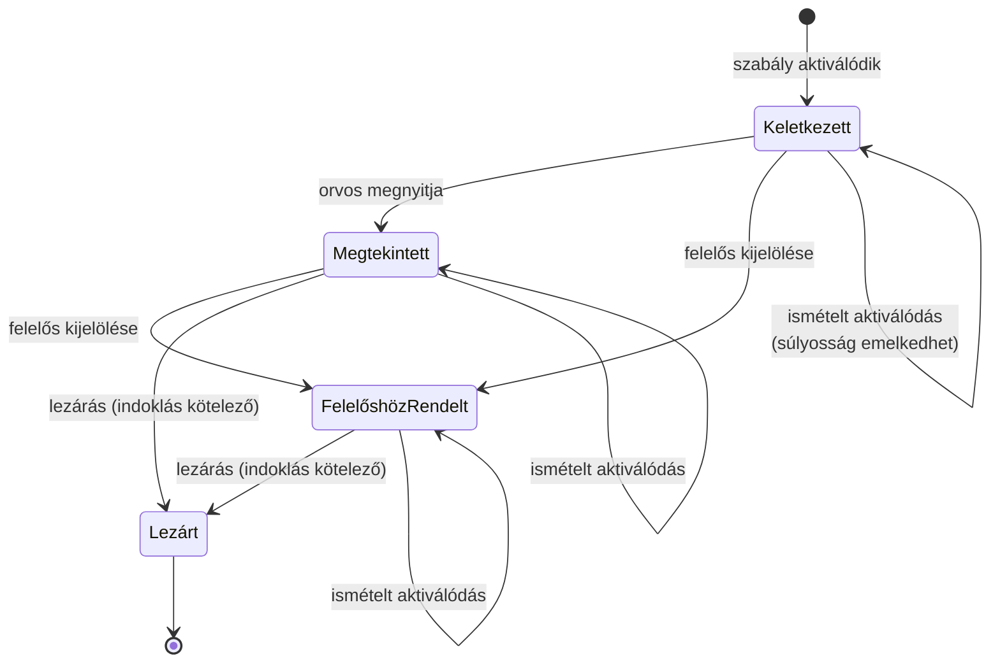
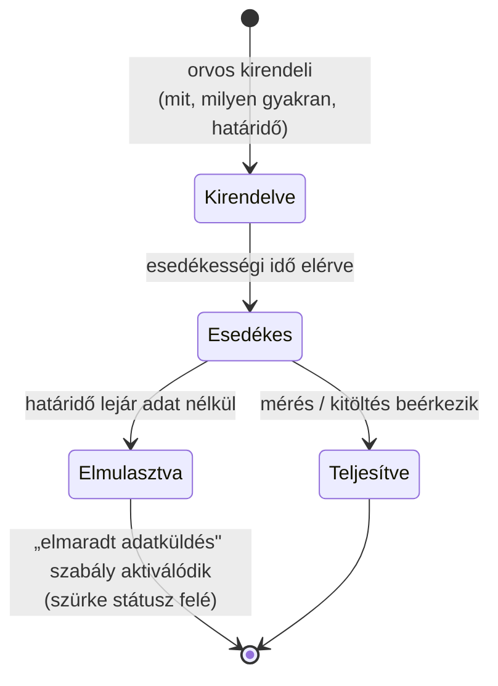
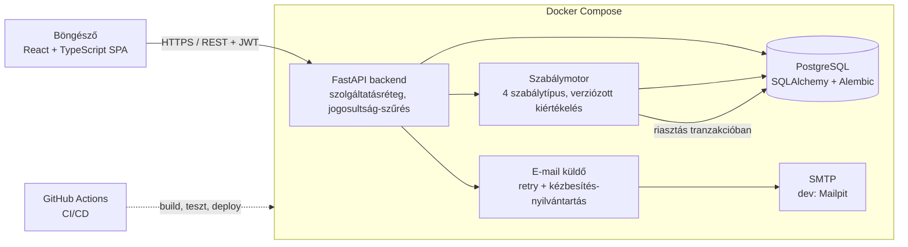

# Folyamat- és architektúraábrák

Kiegészítő ábrák az adatmodellhez: a két kulcs-életciklus állapotgépe és a
rendszer architektúrája.

## Riasztás-életút (állapotgép)

Minden átmenet `AlertEvent`-ként rögzül (ki, mikor, mit); a lezárás indoklása
kötelező. A nyitott riasztás melletti új kiváltó adat nem új riasztás, hanem
„ismételt aktiválódás" esemény.

A beteg zöld/sárga/piros/szürke státusza a **nyitott** jelzésekből számítódik
— a riasztás lezárása tehát elkülönül a beteg állapotjelzésétől: lezáráskor a
státusz újraszámítódik a fennmaradó nyitott jelzések alapján.

## Kirendelés-életciklus (követési terv eleme)

## Architektúra

A szabálymotor a backend része (nem külön szolgáltatás), de logikailag
elkülönített modul: bemenete a beérkező/javított adat, kimenete riasztás vagy
„ismételt aktiválódás" esemény, mindig adatbázis-tranzakción belül. Az
e-mail-küldés a tranzakción kívül, újrapróbálkozással történik.
